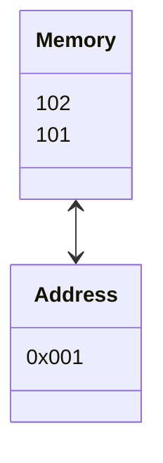
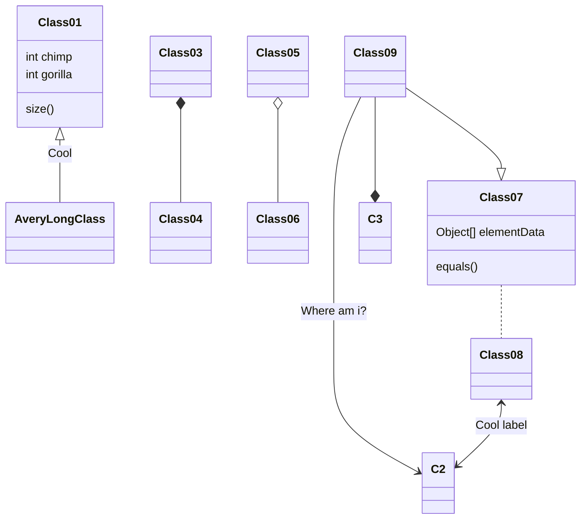

# 포인터

> 메모리의 주소를 저장하고 있는 메모리가 포인터
> 포인터 변수의 크기는 `4`(32비트) or `8`(64비트) 바이트

${short} \quad *ptr$

---

## `Example`

```c
  short data;   // short 형변수
  short *prt;   // 포인터가 가르키는 대상의 크기가 2바이트인 포인터 변수 선언
  ptr = &data;  // data 변수 주소를 ptr 에 할당
  *prt = 1042;  // ptr 에 저장된 주소에 가서 값 1042를 대입, 즉 data = 1042
```

---

## `*` 키워드 사용별 의미 차이

(1) $short\;\;*ptr$ : (포인터 변수를 선언하기 위하여 사용한 키워드)  
(2) $*ptr = 1042$ : (번지지정연산자 : ptr 에 저장된 `주소`에다 1042를 할당하라는 의미의 키워드)

```c
// 포인터 변수에 저장된 주소는 포인터가 가리키는 대상메모리의 시작주소
short *ptr;
ptr = (short*)0x000006C; // 캐스팅 방식
```

---

## 메모리 주소 지정방식

- (1) `직접 주소 지정방식`: 일반변수
  - `0x0412` 값을 `0x66번지` 에 지정하라의 어셈블리 표현식
    - (어셈블리) : | 명령 | | 대상 | | 원본 |
    - `mov  word ptr[66h],  0412h`
    - 0412h 값을 prt[66] 에 word (2byte, short) 단위로 대입하라
    - h(hexa)
      - word(2byte, short), dword(4byte, int), qword(8byte, long)
  - `C` 언어식 표현
      1. (변수선언) short data; => data 의 메모리 주소가 0x66h 로 가정
      2. (값 할당) data = 0x0412; (컴파일) => [mov word ptr[0x66h], 0412h]

  - 직접 주소 지정방식의 한계
    - 서로 다른 함수에 존재하는 변수 직접 참조 불가능
    - 단, 매개변수와 반환값을 이용하여 다른 함수에 존재하는 지역 변수들 간 값 전달 가능
    - 반환값은 1개의 값만 전달 가능
    - 주소가 명령어에 포함 되어 있으므로 실행중에 주소를 변경할 수 없음으로 소스를 수정(재컴파일) 불가피

- (2) `간접 주소 지정방식` : 포인터
  - 사물함과 같은 매개체를 이용해 주소를 간접적으로 명시함
  - 실행중에 주소를 변경할 수 있음, 명령어와 주소가 분리되어 있기 때문
  - 융통성이 큼
  - 102번지에 4바이트 크기의 주소가 저장되어 있는데, 이 주소에 가서 값 1042를 2바이트 크기로 대입하라

## 포인터를 사용하는 이유 (간접 주소 방식으로 값을 대입하는 이유)

- 모든 변수가 같은 함수에 선언되는 것이 아니기 때문에 각각의 함수간의 변수가 단절되어 있음
- 다른 함수에 선언된 변수의 값을 읽거나 변경하기 위함

## 포인터 변수의 주소 연산
1. 시작 주소와 끝 주소를 기억하는 것
   - $|(start) - | - | - |(end) - |$
2. 시작 주소와 사용할 크기를 기억하는 것 : 보편적인 방식
   - `시작주소` + `사용할 크기` (4바이트) : $int \;*p;$
3. 주소 연산
   - 포인터 변수가 가진 주소를 연산하면 자신이 가르키는 대상의 타입 크기 만큼 연산
   - e.g., int 형 포인터 + 1 = +4바이트(or 8) 를 의미함, short = +2 바이트 주소, char = +1 바이트 주소
```c
  short data = 0;
  short *p = &data;
  
  p = p + 1; 
  // 포인터 변수에 저장된 주소도 일반변수 처럼 연산 가능
  // 포인터에서 +1 의 의미는 그 다음 데이터의 주소를 의미
```


---

### $1042_{10}$

- `0000 0100 0001 0010`
- 리틀엔디언 방식 | (102) `18` | (103) `4` |
- 16진법 표기 -> `0x0412`

- 16진법 메모리 형태
  - C 언어에서는 2진수를 직접 사용하는 방법을 제공하지 않음
  - 2진수에 가장 가까운 표현법인 16진수를 주로 사용
  - 16진수의 한 자릿수는 4비트 ($2^4 = 16$) 로 표시가능




